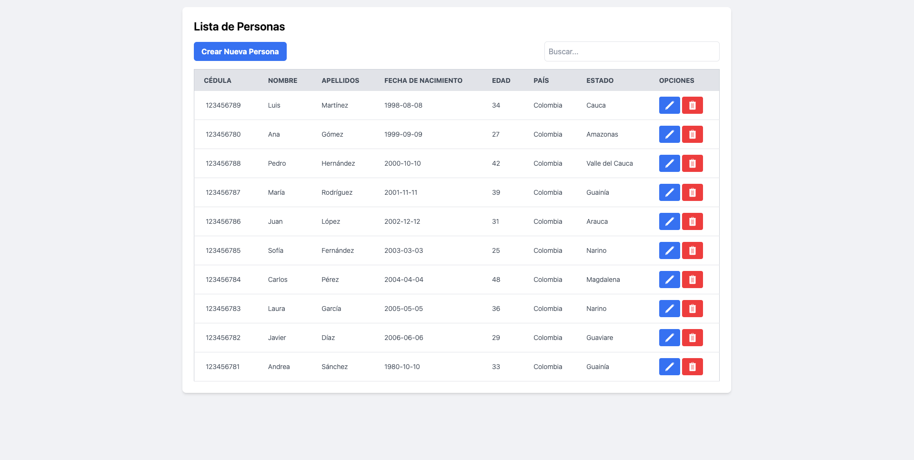
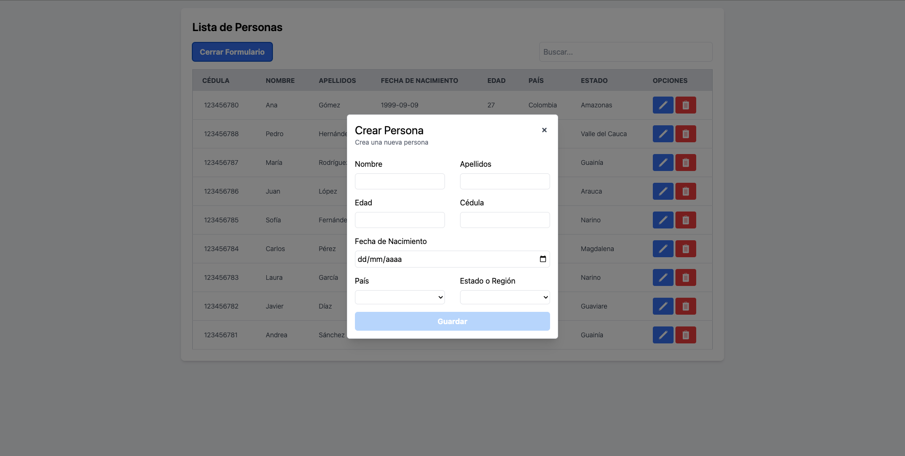
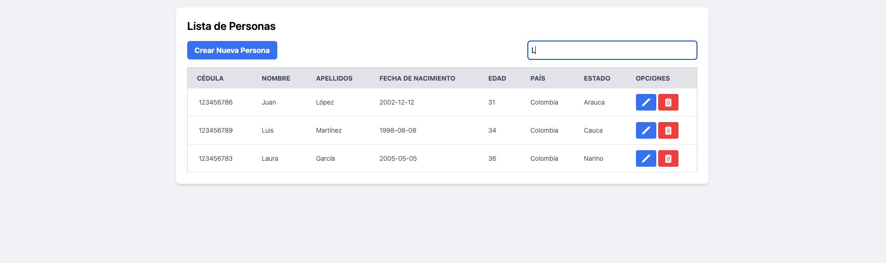

# 🚀 Proyecto Full Stack CRUD


Este proyecto es una aplicación full stack que demuestra operaciones CRUD (Create, Read, Update, Delete) utilizando Spring Boot para el backend y Angular para el frontend.

## 📁 Estructura del Proyecto

El repositorio está organizado de la siguiente manera:

```bash
├── CRUD/              # Backend (Spring Boot)
├── my-app/            # Frontend (Angular)
```

## 🛠️ Cómo clonar y configurar el proyecto

1. Clona el repositorio:

```bash
git clone https://github.com/juanesrp/PruebaTecnica.git
```

2. La configuracion del back y el frontend se encuentra en sus carpetas.

## 📸 Capturas de la app


_Vista del inicio_


_Formulario para crear persona_


_Busqueda y actualización automatica_
